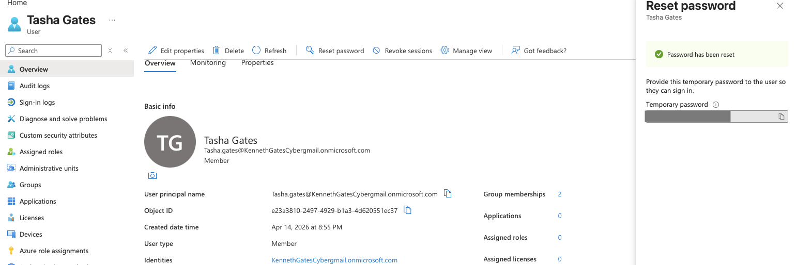

# Cloud IAM Help Desk Lab (Microsoft Entra ID)

## Overview
This project simulates real-world IT support and Identity & Access Management (IAM) tasks using Microsoft Entra ID. The lab demonstrates user lifecycle management, access control, and common help desk operations in a cloud environment.

## Technologies Used
- Microsoft Entra ID
- Microsoft Azure Portal

## Objectives
- Manage user identities in a cloud environment
- Simulate help desk support tasks
- Demonstrate onboarding and offboarding workflows
- Use group-based access control

## Help Desk Ticket Simulations

### Ticket 1: Password Reset Request
#### 📸 Screenshots

**Step 1: User account overview**

**Step 2: Initiating password reset**

**Step 3: Temporary password generated**

**Issue:** User was unable to log in due to a forgotten password.  
**Resolution:** Reset the user password in Microsoft Entra ID and required password change at next login.  
**Result:** User regained access successfully.

### Ticket 2: Account Deactivation (Offboarding)
**Issue:** An employee left the company and account access needed to be removed.  
**Resolution:** Disabled the user account by blocking sign-in.  
**Result:** Account access was removed successfully.

### Ticket 3: Access Request Resolution
**Issue:** User could not access required resources.  
**Resolution:** Added the user to the appropriate security group.  
**Result:** User gained the correct access.

### Ticket 4: New User Onboarding
**Issue:** A new employee needed an account and access assigned.  
**Resolution:** Created a new user, added job title and department, and assigned the user to the proper group.  
**Result:** User was successfully onboarded.

## Key Concepts Demonstrated
- Identity Management
- Group-Based Access Control
- User Onboarding
- User Offboarding
- Password Reset Support

## Screenshots
Screenshots will be added to the images folder for each ticket scenario.

## What I Learned
- How to manage users in Microsoft Entra ID
- How to use groups for access control
- How to support common help desk identity tasks
- How IAM supports daily IT operations
