# Cloud IAM Help Desk Lab (Microsoft Entra ID)

## Overview

This project simulates real-world IT help desk and Identity & Access Management (IAM) scenarios using Microsoft Entra ID. It demonstrates the full user identity lifecycle — onboarding, offboarding, password resets, and security group-based access provisioning — with a focus on the security controls and audit practices expected in enterprise cloud environments.

## Technologies Used

- Microsoft Entra ID (Azure Active Directory)
- Microsoft Azure Portal

## Objectives

- Manage user identities across the full lifecycle in a cloud-native environment
- Simulate common help desk IAM support tasks
- Demonstrate secure onboarding and offboarding workflows
- Apply security group-based access provisioning (least privilege)
- Verify actions through Entra ID audit and sign-in logs

---

## Help Desk Ticket Simulations

---

### Ticket 1: Password Reset Request

#### 📸 Screenshots

**Step 1: User account overview**
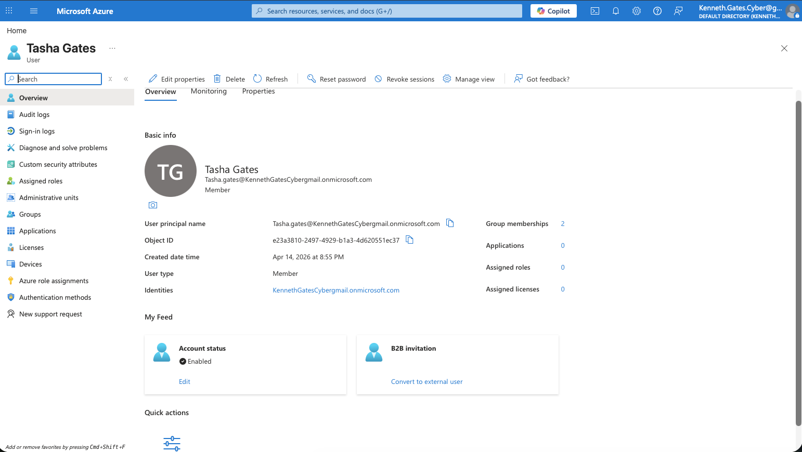

**Step 2: Initiating password reset**
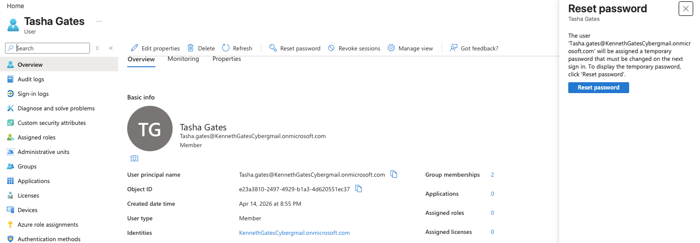

**Step 3: Temporary password generated**

**Issue:** User was unable to log in due to a forgotten password.

**Resolution:** Reset the user's password in Microsoft Entra ID and enforced a mandatory password change at next login.

**Result:** User regained access successfully.

#### 🔒 Security Considerations

- The "Require password change at next login" flag is critical — it ensures the temporary password is never the user's permanent credential.
- In production, this workflow should be paired with **Self-Service Password Reset (SSPR)** to reduce help desk burden while maintaining security controls.
- Admin-initiated resets are captured in the **Entra ID Audit Log** under `Reset password (by admin)`, providing a traceable record for compliance purposes.
- If MFA is enforced via Conditional Access, the user will be prompted to re-verify after the reset, preventing unauthorized account takeover via a compromised reset flow.

---

### Ticket 2: Account Deactivation (Offboarding)

#### 📸 Screenshots

**Step 1: Locate user in Microsoft Entra ID**
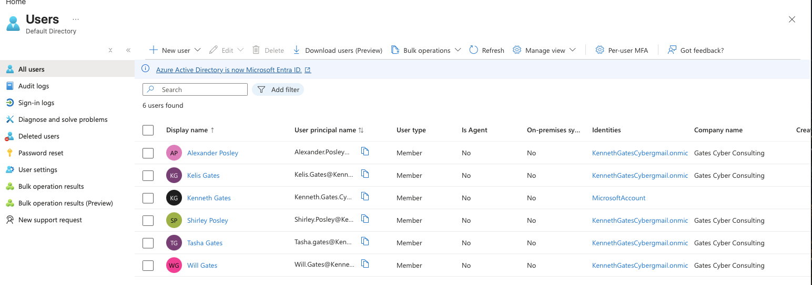

**Step 2: Review user account details**
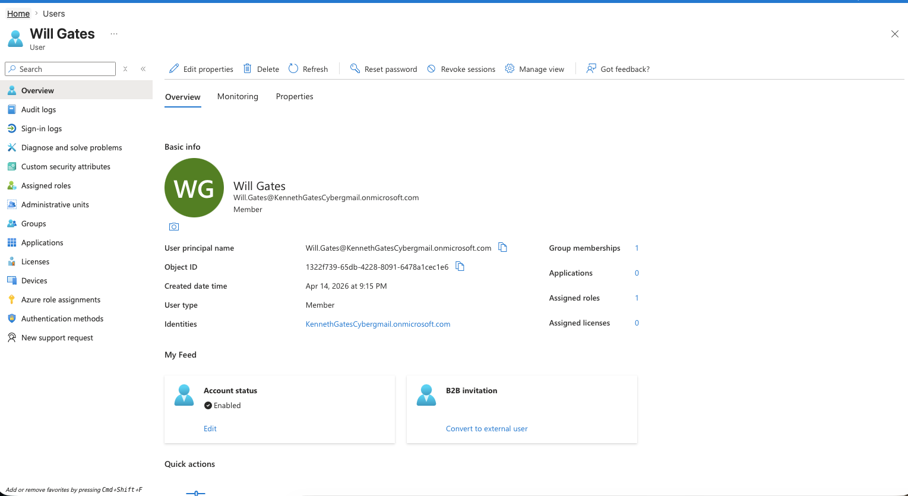

**Step 3: Verify account is currently enabled**
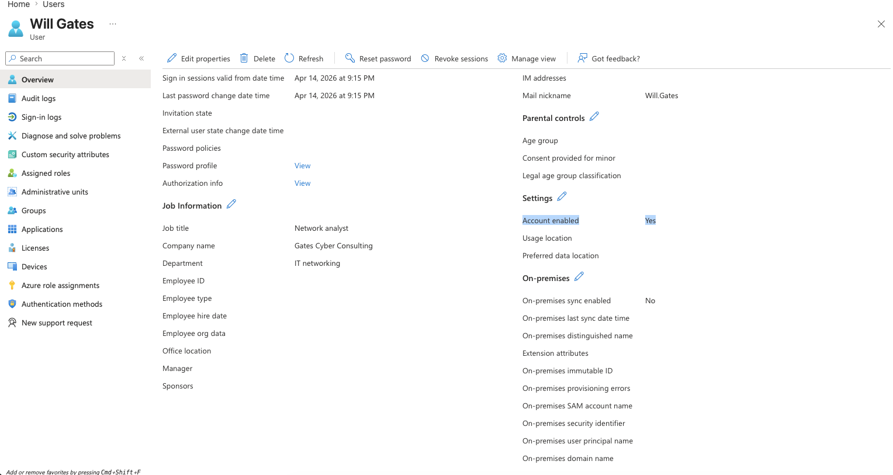

**Step 4: Disable account by blocking sign-in**
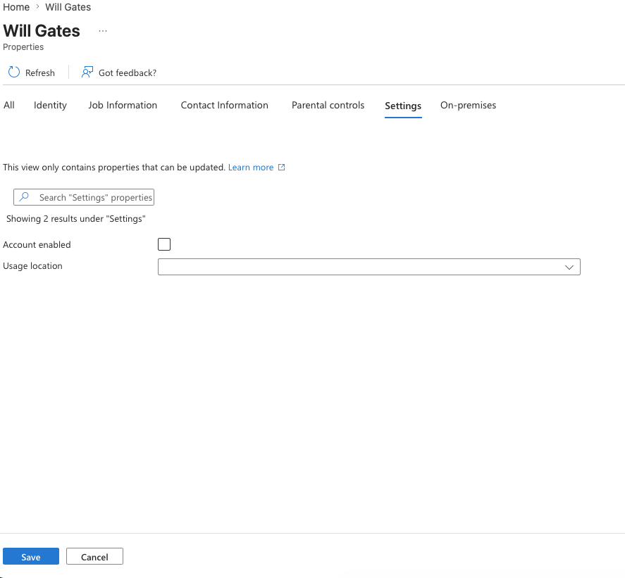

**Issue:** An employee left the company and account access needed to be removed immediately.

**Resolution:** Disabled the user account by blocking sign-in in Microsoft Entra ID.

**Result:** Account access was successfully removed, preventing further login.

#### 🔒 Security Considerations

Blocking sign-in is the first step in offboarding, but **it is not sufficient on its own**. A complete offboarding sequence should also include:

- **Revoke active sessions** — Use the "Revoke sessions" action in Entra ID to invalidate any existing refresh tokens and OAuth tokens. Without this step, an active session can persist even after sign-in is blocked, because Microsoft's token lifetime policies allow tokens to remain valid until expiry.
- **Remove group memberships** — Revoke access to all security groups and M365 groups to cut off resource access.
- **Remove MFA devices and app registrations** — Deregister any authenticator apps or hardware tokens tied to the account.
- **Transfer ownership of shared resources** — OneDrive, shared mailboxes, and Teams channels should be reassigned before the account is deleted.
- **License reclamation** — Remove M365 license assignments to free up allocated licenses.

The full offboarding action is logged in the Entra ID Audit Log, providing a timestamped record that supports access review and compliance reporting.

---

### Ticket 3: Access Request (Security Group-Based Access Provisioning)

#### 📸 Screenshots

**Step 1: Navigate to Groups in Microsoft Entra ID**
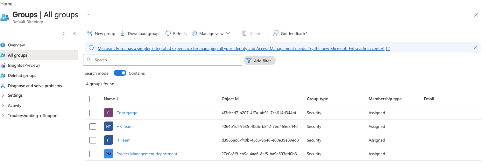

**Step 2: Select the appropriate group (IT Team)**
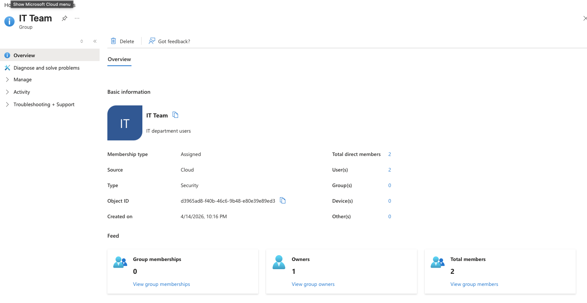

**Step 3: Review current group members**
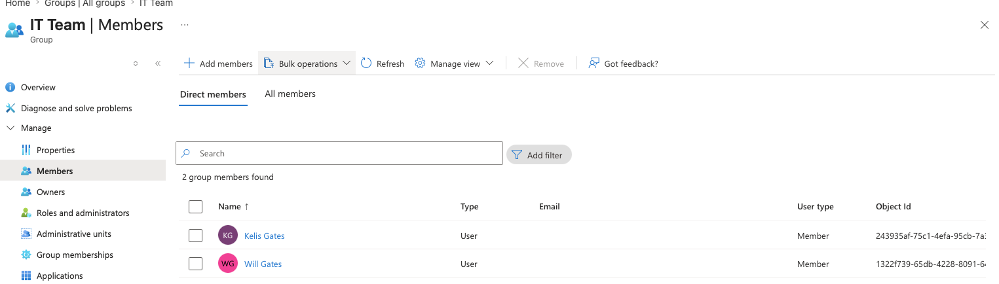

**Step 4: Add user to group**
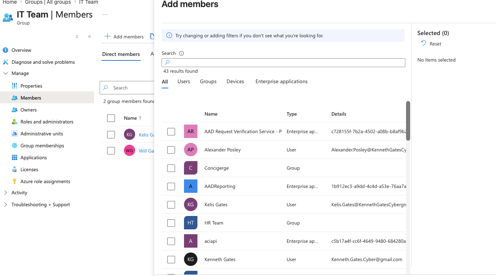

**Step 5: Confirm user successfully added to group**
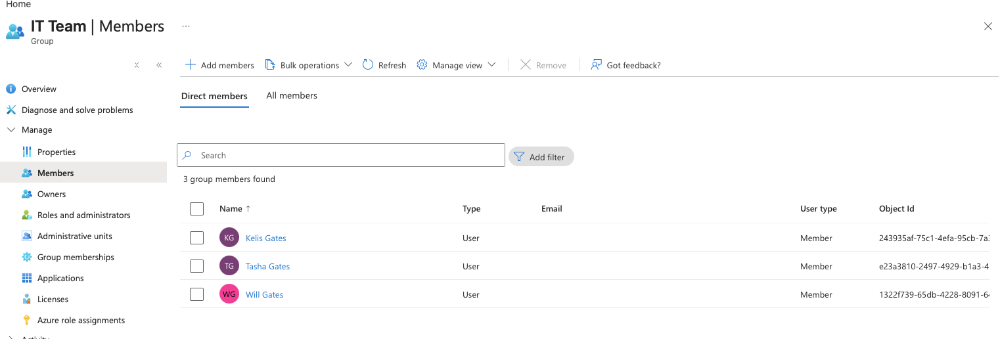

**Issue:** User required access to IT resources to perform job responsibilities.

**Resolution:** Added the user to the IT Team security group in Microsoft Entra ID to grant access through group-based permissions.

**Result:** User successfully gained access to required systems.

#### 🔒 Security Considerations

- Access is granted through **security group membership**, not direct role assignment — this supports **least privilege** and simplifies access reviews. Permissions are managed at the group level, not per user.
- Before adding a user to a group, the approving party should verify that the request is authorized (manager approval, ticketing system record). This prevents unauthorized privilege escalation.
- In production environments, this process should be governed by an **Access Request workflow** (e.g., via Microsoft Identity Governance's Entitlement Management), which enforces approval gates and auto-expiration of access.
- Group membership changes are recorded in the Entra ID Audit Log under `Add member to group`, enabling access traceability for SOC and compliance teams.

---

### Ticket 4: User Onboarding (Account Creation + Group Assignment)

#### 📸 Screenshots

**Step 1: Navigate to Users in Microsoft Entra ID**
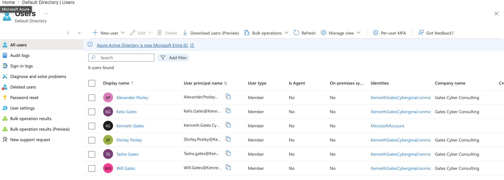

**Step 2: Click "New user" to begin account creation**
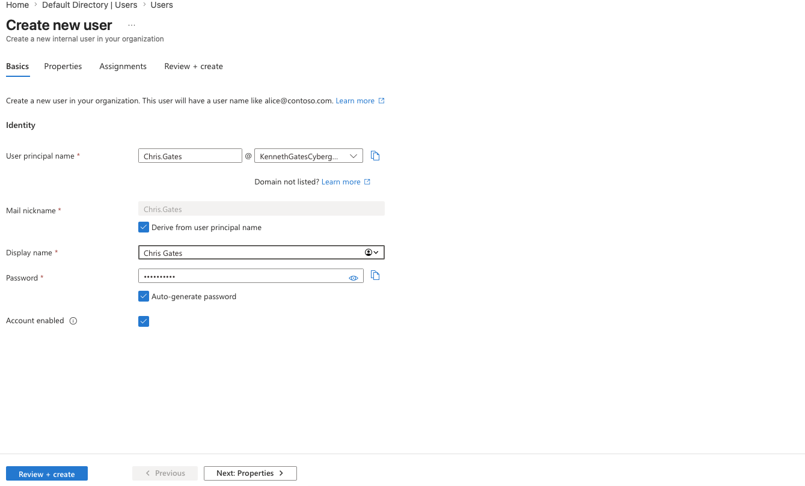

**Step 3: Enter basic user details (name, username, temporary password)**
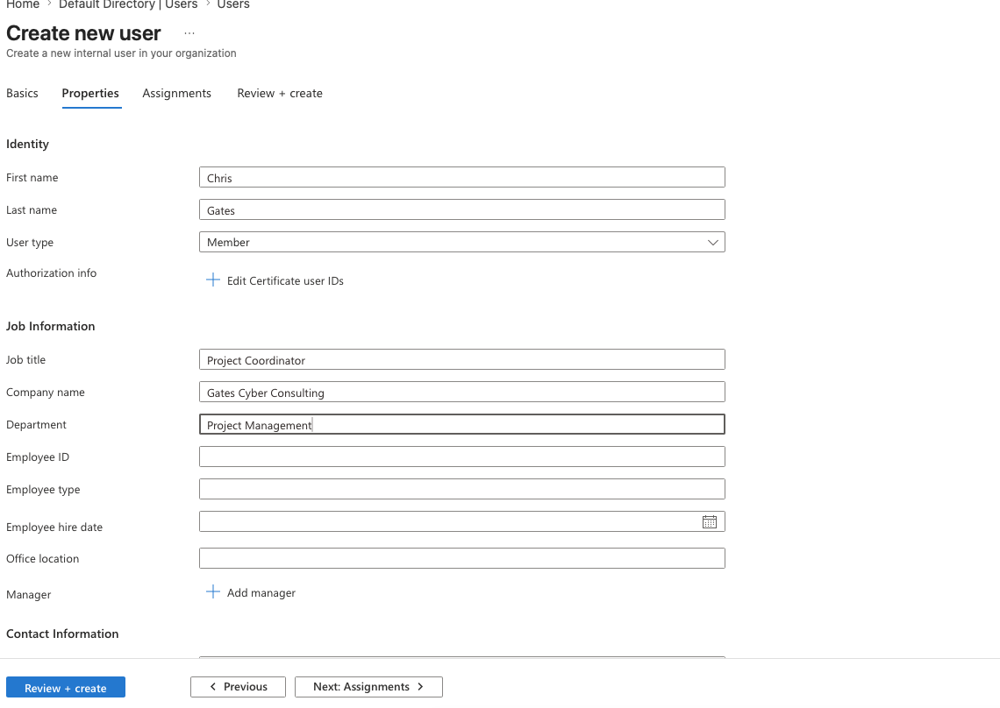

**Step 4: Configure user properties (job title, department, company)**
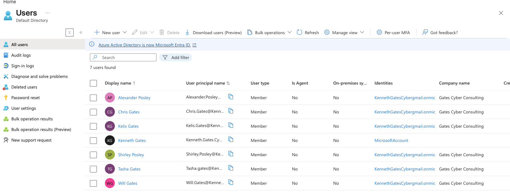

**Step 5: Review and create the new user account**
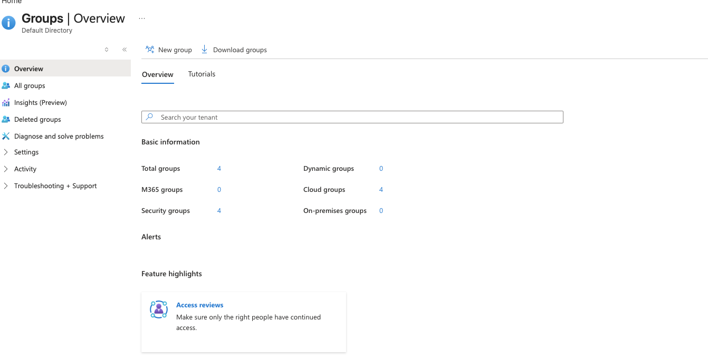

**Step 6: Confirm user appears in directory**
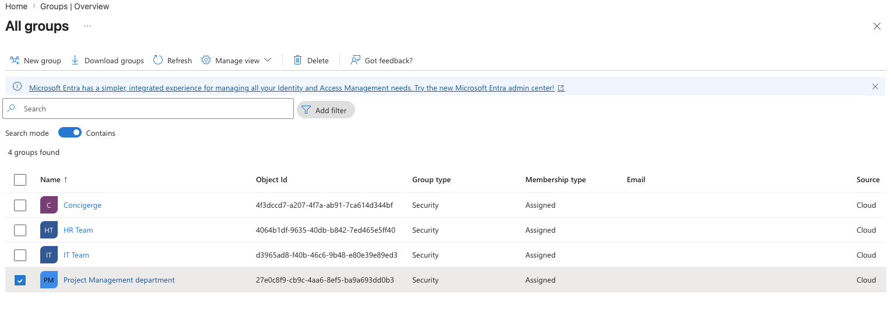

**Step 7: Navigate to Groups**
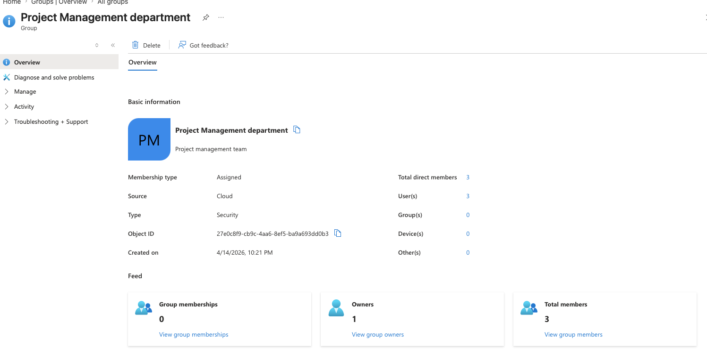

**Step 8: Select appropriate department group**
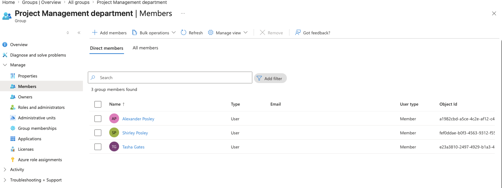

**Step 9: Add new user to group**
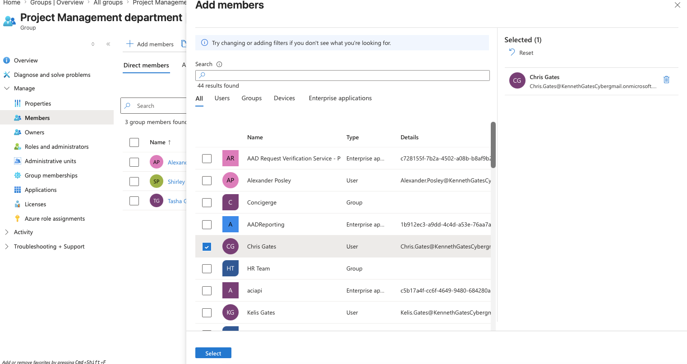

**Step 10: Confirm user successfully added to group**
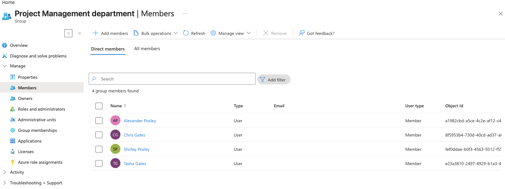

**Issue:** A new employee required an account and access to company resources.

**Resolution:** Created a new user account in Microsoft Entra ID with a temporary password (change required at first login), populated identity attributes (job title, department), and assigned the user to the appropriate department security group.

**Result:** User account was successfully created and granted access through group membership.

#### 🔒 Security Considerations

- User attributes (department, job title) are populated at creation to support **dynamic group membership** rules and Conditional Access policy targeting in production environments.
- The account was created with a **temporary password requiring change at first login** — this ensures the admin never knows the user's working credential.
- In production, onboarding should trigger **MFA registration enforcement** via Conditional Access on first sign-in. Without MFA, the account is protected only by a password.
- Assigning the user to a **department security group** rather than granting individual resource permissions follows least-privilege principles and makes future access reviews scalable.
- New account creation is captured in the Entra ID Audit Log under `Add user`, with timestamps and the initiating admin's identity recorded.

---

## Key Concepts Demonstrated

- Identity Lifecycle Management (Onboarding, Offboarding, Access Changes)
- Security Group-Based Access Provisioning (Least Privilege)
- Password Reset and Credential Security
- Audit Log Verification and Access Traceability
- Session Revocation and Token Invalidation
- Secure Offboarding Practices

---

## Skills Demonstrated

- Identity & Access Management (IAM)
- Microsoft Entra ID Administration
- User Lifecycle Management
- Security Group Administration
- Access Provisioning & Deprovisioning
- Help Desk Support (IAM-Focused)
- Audit Log Review and Compliance Awareness
- Least Privilege and Zero Trust Principles

---

## What I Learned

Managing identities in Microsoft Entra ID goes beyond clicking through a portal — every action carries a security implication. The most important lesson from this lab was understanding that **blocking sign-in alone does not fully revoke access**; active tokens and sessions must be explicitly invalidated during offboarding to prevent residual access. I also learned why group-based access provisioning is preferred over direct assignment at scale — it simplifies access reviews, reduces human error, and makes least-privilege enforcement consistent. Finally, every action in Entra ID produces an audit log entry, and verifying those entries is part of the workflow, not an afterthought — it is how security teams demonstrate compliance and detect unauthorized changes.
#### 📸 Screenshots

**Step 1: Navigate to Groups in Microsoft Entra ID**  

**Step 2: Select the appropriate group (IT Team)**  

**Step 3: Review current group members**  

**Step 4: Add user to group**  

**Step 5: Confirm user successfully added to group**  

**Issue:** User required access to IT resources to perform job responsibilities.  

**Resolution:** Added the user to the IT Team security group in Microsoft Entra ID to grant appropriate access permissions.  

**Result:** User successfully gained access to required systems through group-based access control.

### Ticket 4: User Onboarding (Account Creation + Group Assignment)

#### 📸 Screenshots

**Step 1: Navigate to Users in Microsoft Entra ID**  

**Step 2: Click "New user" to begin account creation**  

**Step 3: Enter basic user details (name, username, password)**  

**Step 4: Configure user properties (job title, department, company)**  

**Step 5: Review and create the new user account**  

**Step 6: Confirm user appears in directory**  

**Step 7: Navigate to Groups**  

**Step 8: Select appropriate department group**  

**Step 9: Add new user to group**  

**Step 10: Confirm user successfully added to group**  

**Issue:** A new employee required an account and access to company resources.  

**Resolution:** Created a new user account in Microsoft Entra ID and assigned the user to the appropriate department security group.  

**Result:** User account was successfully created and granted proper access based on role and group membership.

## Key Concepts Demonstrated
- Identity Management
- Group-Based Access Control
- User Onboarding
- User Offboarding
- Password Reset Support

## 💼 Skills Demonstrated
- Identity & Access Management (IAM)
- User Lifecycle Management (Onboarding/Offboarding)
- Role-Based Access Control (RBAC)
- Microsoft Entra ID Administration
- Help Desk Troubleshooting
- Access Provisioning & Deprovisioning
- 
## What I Learned
- How to manage users in Microsoft Entra ID
- How to use groups for access control
- How to support common help desk identity tasks
- How IAM supports daily IT operations
